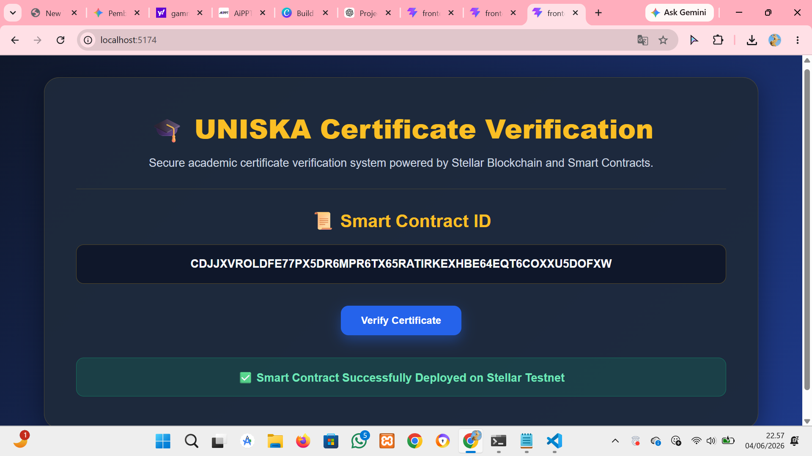
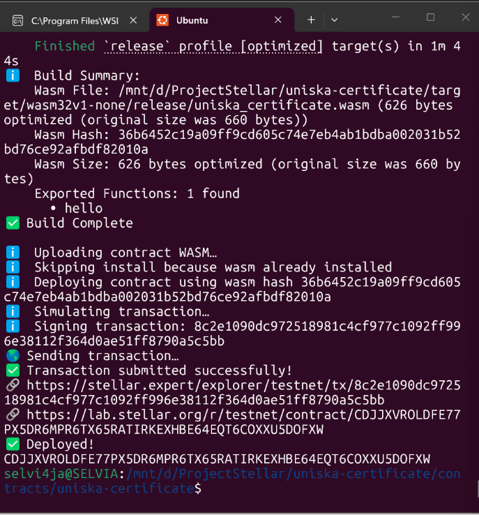

# UNISKA Certificate Verification

## Project Description

UNISKA Certificate Verification is a blockchain-based certificate verification system built using Stellar Smart Contracts. This project demonstrates how academic certificates can be verified transparently and securely through blockchain technology.

The system stores certificate verification data on the Stellar Testnet and provides a simple web interface for users to view and verify the deployed smart contract.

---

## Features

* Blockchain-based certificate verification
* Stellar Smart Contract integration
* Smart Contract deployment on Stellar Testnet
* Modern React frontend interface
* Transparent and secure verification process

---

## Smart Contract Information

**Contract ID**

```text
CDJJXVROLDFE77PX5DR6MPR6TX65RATIRKEXHBE64EQT6COXXU5DOFXW
```

**Network**

```text
Stellar Testnet
```

---

## Technology Stack

* Stellar Smart Contracts (Soroban)
* Rust
* React.js
* Vite
* JavaScript
* GitHub

---

## Frontend Screenshot

Frontend interface:



---

## Deployment Screenshot

Smart contract deployment result:



---

## Project Structure

```text
uniska-certificate-verification/
│
├── frontend/
│   ├── src/
│   ├── public/
│   └── package.json
│
├── uniska-certificate/
│   └── contracts/
│
├── contract-id.txt
├── frontend.png
├── deploy.png
└── README.md
```

---

## How to Run

### Frontend

```bash
cd frontend
npm install
npm run dev
```

### Smart Contract

```bash
cd uniska-certificate
stellar contract build
stellar contract deploy
```

---

## Author

**Selvia Melani Putri**

UNISKA MAB Banjarmasin

Blockchain Workshop Submission Project
